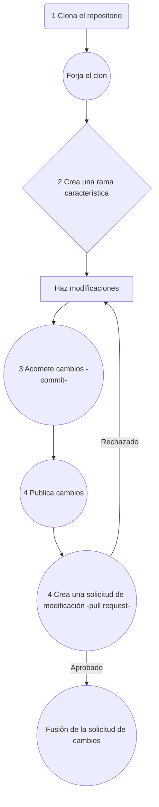

<!-- PROJECT SHIELDS -->
<!--
*** I'm using markdown "reference style" links for readability.
*** Reference links are enclosed in brackets [ ] instead of parentheses ( ).
*** See the bottom of this document for the declaration of the reference variables
*** for contributors-url, forks-url, etc. This is an optional, concise syntax you may use.
*** https://www.markdownguide.org/basic-syntax/#reference-style-links
-->

<!-- Aquí iran insignias de github, que serán habilitadas cuando el proyecto esté en público -->

[![Contributors][contributors-shield]][contributors-url]
[![Forks][forks-shield]][forks-url]
[![Stargazers][stars-shield]][stars-url]
[![Issues][issues-shield]][issues-url]
[![MIT License][license-shield]][license-url] 


<!-- PROJECT LOGO -->
<br />
<div align="center">
  <!-- 
  <a href="https://github.com/othneildrew/Best-README-Template">
     
  </a>
  -->

  <h1 align="center"><span style="color:green">A</span><span style="color:orange">gro<span><span style="color:green">S</span>mart</h1>

</div>


<!-- ABOUT THE PROJECT -->
## El proyecto


Es una plataforma web diseñada para ayudar a los agricultores a optimizar sus cultivos mediante el uso de datos meteorológicos, sensores inteligentes, recomendaciones personalizadas y acceso a mercados locales e internacionales. Utilizando inteligencia artificial y análisis de datos, la plataforma pretende mejorar la productividad, reducir el desperdicio y aumentar los ingresos de los agricultores. 


### Herramientas de construcción

* Diseño de [interfaz](https://www.figma.com/design/f8Gz2AhBKFWJ4zMDqlUonq/Agricultura-inteligente?node-id=1-8&node-type=canvas&t=6GJZLG8wmJHqycdB-0) y [prototipo](https://www.figma.com/proto/f8Gz2AhBKFWJ4zMDqlUonq/Agricultura-inteligente?page-id=1%3A8&node-id=31-614&node-type=FRAME&viewport=436%2C251%2C0.16&t=o1V420R49LM2dUlG-1&scaling=scale-down-width&content-scaling=fixed)

* Backend: 
   * [![NodeJS][NodeJS]][Node-url] [![Express.js][Express.js]][Express-url]
   * [Deploy](https://s17-05-m-node-back.onrender.com/api/v0)

* Frontend: 
   * [![Next.js][Next.js]][Next-url]
   * [Deploy](https://s17-05-m-node-react.onrender.com/)


<!-- GETTING STARTED -->
## Inicio

A continuación las instrucciones para correr el proyecto de forma local.

### Prerequisitos

* En la línea de comandos revisar si tienes instalado NodeJs
  ```sh
  node -v
  ```
Si no está instalado, [descargarlo](https://nodejs.org/en) e instalarlo.

### Instalación

1. Clona el repositorio
   ```sh
   git clone git@github.com:No-Country-simulation/s17-05-m-node-react.git
   ```
1. Abre el directorio del proyecto Frontend o Backend
   ```sh
   cd directorio
   ```
   
3. Instalar los paquetes desde NPM
   ```sh
   npm install
   ```
4. Correr el proyecto en modo de desarrollo
   ```js
   npm run dev
   ```


<!-- ROADMAP -->
## Características

1. Datos Meteorológicos en Tiempo Real: Los agricultores pueden acceder a pronósticos y condiciones climáticas específicas para su ubicación. Esto les ayuda a planificar actividades como riego, siembra y cosecha mejorando la productividad. 

2. Recomendaciones Personalizadas: Utilizando inteligencia artificial y análisis de datos, la plataforma genera sugerencias específicas sobre qué cultivos plantar, cuándo hacerlo, y qué técnicas utilizar, basándose en factores como la región, tipo de suelo y condiciones climáticas actuales. 

3. Acceso a Mercados: Los agricultores tienen la posibilidad de conectar con mercados locales e internacionales, aumentando las oportunidades de venta y reduciendo intermediarios. La plataforma facilita el contacto con compradores y la gestión de la logística de exportación. 

4. Integración de Sensores IoT: Permite a los agricultores que lo deseen integrar sensores de monitoreo en sus campos para un análisis en tiempo real. (Pendiente) 
    

Vea las [incidencias abiertas (issues)](https://github.com/No-Country-simulation/s17-05-m-node-react/switchmodes/issues) para una lista completa de las características (e incidencias conocidas).


<!-- CONTRIBUTING -->
## Contribuciones

Las contribuciones son las que hacen de la comunidad de código abierto un maravilloso lugar para aprender, inspirarse y crear. Cualquier contribución sera **grándemente apreciada**.

Si tiene una sugerencia que haga mejorar este proyecto, por favor haga un fork del repositorio y envíe una solicitud de modificación (pullrequest). También puede abrir una incidencias (issue) con la etiqueta "enhancement".

Favor no olvidar reconocer el proyecto con una estrella. 

Pasos para hacer contribuciones al proyecto:

1. Haga un Fork del proyecto
2. Crea tu rama con el nombre de la característica (`git checkout -b característica/CaracterísticaAsombrosa`)
3. Acomete tus cambios (`git commit -m 'Add some CaracterísticaAsombrosa'`)
4. Publica tu rama (`git push origin feature/AmazingFeature`)
5. Abre una solicitud de modificación (pull request)





<!-- LICENSE -->
## Licencia

Distribuido bajo la licencia MIT. Ver `LICENSE.txt` para mayor información.


<!-- CONTACT -->
## Contactar
| Nombre | Forma de contacto |
|------|-----|
| Orlando | [X](https://x.com/OrlandoFloresH) [Linktree](https://linktr.ee/lalomax) lalomax365@gmail.com |

<!-- Link del proyecto: [https://github.com/lalomax/malware](https://github.com/lalomax/malware) -->


<!-- ACKNOWLEDGMENTS -->
## Reconocimientos

Queremos dar un reconocimiento especial a estas organizaciones por el impulso para lanzar este proyecto:

* [No Country](https://www.nocountry.tech/)
* [OpenWeather](https://openweathermap.org/api)
* [Leaflet](https://leafletjs.com/)


<!-- MARKDOWN LINKS & IMAGES -->
<!-- https://www.markdownguide.org/basic-syntax/#reference-style-links -->
[contributors-shield]: https://img.shields.io/github/contributors/No-Country-simulation/s17-05-m-node-react.svg?style=for-the-badge
[contributors-url]: https://github.com/No-Country-simulation/s17-05-m-node-react/graphs/contributors
[forks-shield]: https://img.shields.io/github/forks/No-Country-simulation/s17-05-m-node-react.svg?style=for-the-badge
[forks-url]: https://github.com/No-Country-simulation/s17-05-m-node-react/switchmodes/network/members
[stars-shield]: https://img.shields.io/github/stars/No-Country-simulation/s17-05-m-node-react.svg?style=for-the-badge
[stars-url]: https://github.com/No-Country-simulation/s17-05-m-node-react/stargazers
[issues-shield]: https://img.shields.io/github/issues/No-Country-simulation/s17-05-m-node-react.svg?style=for-the-badge
[issues-url]: https://github.com/No-Country-simulation/s17-05-m-node-react/issues
[license-shield]: https://img.shields.io/github/license/lalomax/malware.svg?style=for-the-badge
[license-url]: https://github.com/No-Country-simulation/s17-05-m-node-react/blob/master/LICENSE.txt

[Next.js]: https://img.shields.io/badge/next.js-000000?style=for-the-badge&logo=nextdotjs&logoColor=white
[Next-url]: https://nextjs.org/
[Vitejs]: https://img.shields.io/badge/vite-%23646CFF.svg?style=for-the-badge&logo=vite&logoColor=white
[NodeJS]: https://img.shields.io/badge/node.js-6DA55F?style=for-the-badge&logo=node.js&logoColor=white
[Express.js]: https://img.shields.io/badge/express.js-%23404d59.svg?style=for-the-badge&logo=express&logoColor=%2361DAFB
[Express-url]: https://expressjs.com/
[Node-url]: https://nodejs.org/en
[vite-url]: https://vitejs.dev/
[React.js]: https://img.shields.io/badge/React-20232A?style=for-the-badge&logo=react&logoColor=61DAFB
[React-url]: https://reactjs.org/
[Vue.js]: https://img.shields.io/badge/Vue.js-35495E?style=for-the-badge&logo=vuedotjs&logoColor=4FC08D
[Vue-url]: https://vuejs.org/
[Angular.io]: https://img.shields.io/badge/Angular-DD0031?style=for-the-badge&logo=angular&logoColor=white
[Angular-url]: https://angular.io/
[Svelte.dev]: https://img.shields.io/badge/Svelte-4A4A55?style=for-the-badge&logo=svelte&logoColor=FF3E00
[Svelte-url]: https://svelte.dev/
[Laravel.com]: https://img.shields.io/badge/Laravel-FF2D20?style=for-the-badge&logo=laravel&logoColor=white
[Laravel-url]: https://laravel.com
[Bootstrap.com]: https://img.shields.io/badge/Bootstrap-563D7C?style=for-the-badge&logo=bootstrap&logoColor=white
[Bootstrap-url]: https://getbootstrap.com
[JQuery.com]: https://img.shields.io/badge/jQuery-0769AD?style=for-the-badge&logo=jquery&logoColor=white
[JQuery-url]: https://jquery.com 
